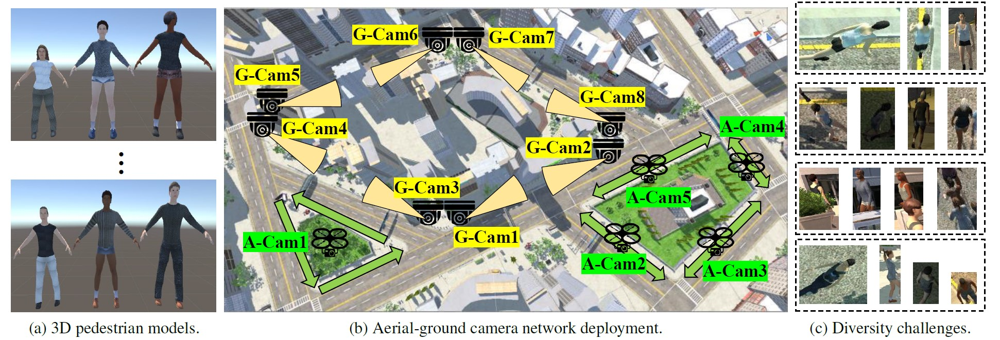
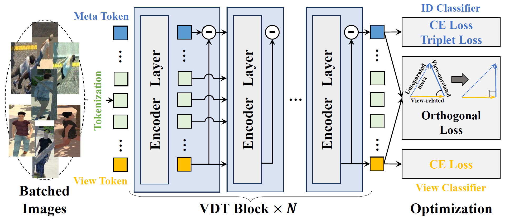

# VDT-AGPReID
View-decoupled Transformer for Person Re-identification under Aerial-ground Camera Network (CVPR'24) [[paper_link]](https://arxiv.org/abs/2403.14513)


## [1] Dataset: CARGO

### Introduction
* CARGO is a large-scale aerial-ground person re-identification (AGPReID) dataset, which captured from a synthesized scene in Unity3D.
* CARGO contains 13 cameras (8 ground and 5 aerial cameras), 5000 person IDs, and 108563 person images.
* **Camera 1 $\sim$ 5 belong to aerial cameras, and Camera 6 $\sim$ 13 belong to ground cameras.**
* In the aerial camera area, two different drone roaming strategies are designed according to the size of the surveillance area. For the small area (left area), we deploy one drone with a $90^\circ$ overhead view, allowing it to move counterclockwise around each street. For a large area (right area), we deploy individual drones on each of the four streets with a $45^\circ\sim60^\circ$ tilt view, allowing them to move back and forth on corresponding streets. 
* Dataset Link: [Google Drive](https://drive.google.com/file/d/1yDjyH0VtW7efxP3vgQjIqTx2oafCB67t/view?usp=drive_link)

### Setting
* We split CARGO into the train (51,451 images with 2500 IDs) and test sets (51,024 images with the remaining 2500 IDs) with an almost 1:1 ratio.
* **Testing Protocol 1 (ALL)** uses full test data and labels, which focuses on the comprehensive retrieval performance.
* **Testing Protocol 2 (G $\leftrightarrow$ G)** only retains the data under the ground camera in the test set (60 query IDs with 134 images, 2404 gallery IDs with 18,444 images).
* **Testing Protocol 3 (A $\leftrightarrow$ A)** only retains the data under the aerial camera in the test set (89 query IDs with 178 images, 2447 gallery IDs with 32,268 images).
* **Testing Protocol 4 (A $\leftrightarrow$ G)** relabels the original test set into two domains (aerial and ground domain) based on the camera label.
* The training set of all testing protocols retains same.

### Annotation
Annotations are preserved in the name of each image by the format ``camID_time_personID_index.jpg''. 

> For example, ``Cam2_day_2519_320.jpg'' means that:
> * Camera id is 2, and it belongs to the aerial view.
> * Capture time is day. (day or night)
> * Person id is 2519.
> * Index is 320. (It has no practical meaning for you.)

### License
* The datasets can only be used for ACADEMIC PURPOSES. NO COMERCIAL USE is allowed.
* Copyright © Sun Yat-sen University. All rights reserved.

## [2] Method: View-decoupled Transformer

### Requirements
#### Step1: Prepare enviorments
Please refer to [INSTALL.md](./INSTALL.md).

#### Step2: Prepare datasets
Download the CARGO dataset and modify the dataset path.
Line 22, 60, 100 and 140 in  [cargo.py](./fastreid/data/datasets/cargo.py) .
> self.data_dir = XXX

#### Step3: Prepare ViT Pre-trained Models
Download the ViT-base Pre-trained model and modify the path. Line 11 in [VDT.yml](./configs/CARGO/VDT.yml):
> PRETRAIN_PATH: XXX

### Training & Testing
Training VDT on the CARGO dataset with one GPU:
```
CUDA_VISIBLE_DEVICES=0 python3 tools/train_net.py --config-file ./configs/CARGO/VDT.yml MODEL.DEVICE "cuda:0"
```

Testing VDT on the CARGO dataset:
```
CUDA_VISIBLE_DEVICES=1 python3 tools/train_net.py --config-file ./configs/CARGO/VDT.yml --eval-only MODEL.WEIGHTS your_model_pth_path MODEL.DEVICE "cuda:0"
```

### Acknowledgement
Codebase from [fast-reid](https://github.com/JDAI-CV/fast-reid). So please refer to that repository for more usage.

## [3] Citation
If you find this code useful for your research, please kindly cite the following papers:
```
@InProceedings{Zhang_2024_CVPR,
    author    = {Zhang, Quan and Wang, Lei and Patel, Vishal M. and Xie, Xiaohua and Lai, Jian-Huang},
    title     = {View-decoupled Transformer for Person Re-identification under Aerial-ground Camera Network},
    booktitle = {Proceedings of the IEEE/CVF Conference on Computer Vision and Pattern Recognition},
    year      = {2024}
}
```
If you have any question, please feel free to contact me. E-mail: zhangq48@mail2.sysu.edu.cn
